# TeamTaskApp（チームタスク管理アプリ）

チームを作成し、タスクを登録・管理できるWebアプリケーションです。  
チームメンバーの招待は、チームコードを共有することで実現できます。

---

## 主な機能

- ユーザー登録 / ログイン（Devise）  
- チームの作成・編集・削除（オーナーのみ）  
- チームコードによる参加機能  
- タスクの作成 / 編集 / 削除 / 詳細表示  
- タスクの状態（着手前・開発中・確認中・完了）切り替え  
- チームメンバー管理（退出）  
- 権限によるアクセス制限（オーナー・参加者以外は閲覧不可）  

---

## 使用技術

- フレームワーク: **Ruby on Rails 7.2**  
- 認証: **Devise**  
- UI: **Tailwind CSS**  
- テスト: **RSpec**, **FactoryBot**  
- DB: **SQLite3**  
- その他: **Importmap**, **Hotwire**, **Turbo**  

---

## セットアップ方法

### 前提条件

- Ruby 3.x　（今回は3.2使用）
- Bundler  

### セットアップ手順

```bash
git clone https://github.com/shinnosukeee/TeamTodo

bundle install
bin/rails db:create db:migrate

# 開発環境で起動
bin/rails server
```

---

## アプリの使い方

1. チーム作成者が「招待する」ボタンでチームコードを確認  
2. 参加者が「チームに参加する」ボタンを押し、チームコードを入力  
3. 正しいコードであればチームに参加完了  

---

## 今後追加予定の機能

- タスクごとにやり取りができる掲示板のような機能
- タスクごとの担当者の概念
- チームメンバー一覧の様なページ

## 実行画面
- Deviseのサインアップ画面
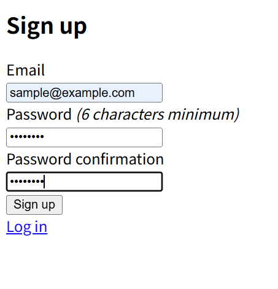
- チーム一覧画面
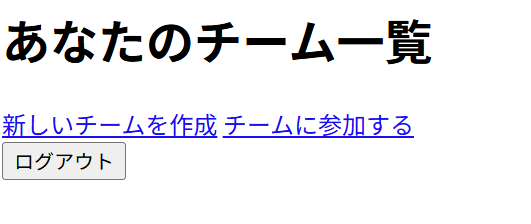
- チーム作成画面(チームオーナー視点)
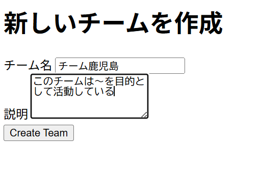
- チーム一覧に作成したチームが追加される
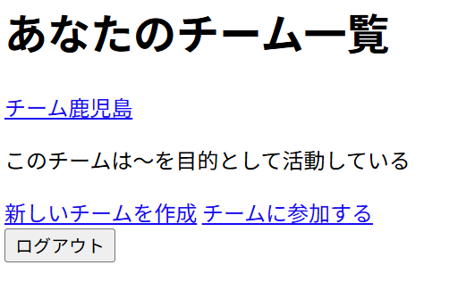
- チーム詳細画面
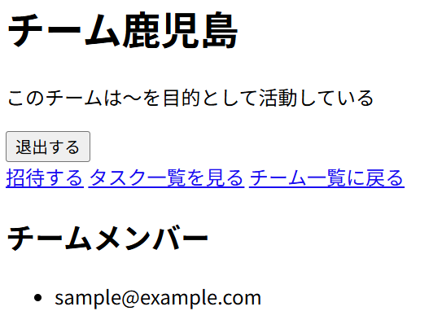
- チームへの招待コード画面
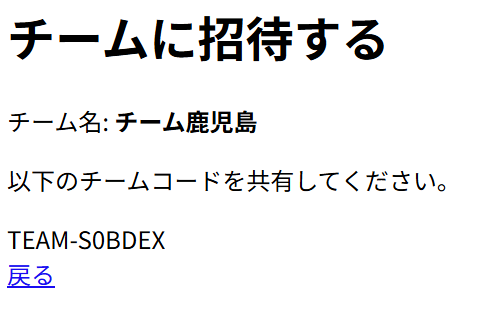
- タスク管理画面
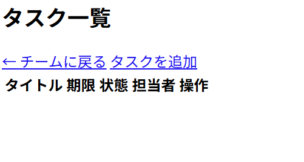
- タスク新規作成画面
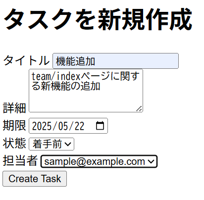
- 作成したタスクが追加される
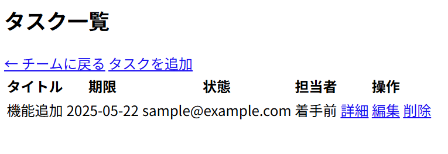
- チーム参加パターン
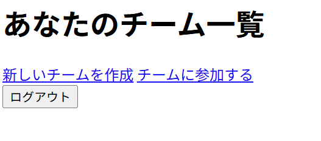
- チームコードの入力
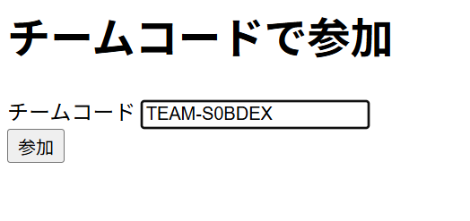
- チームメンバーに追加される
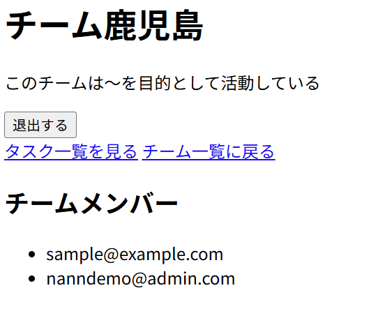

